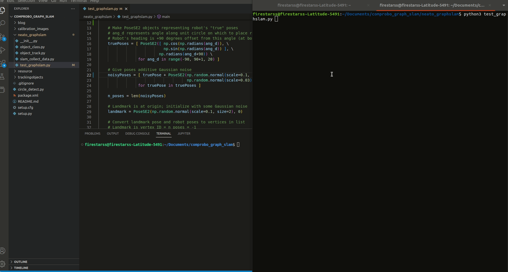

<div align="center">
  <h1> NEATO GraphSLAM </h1>
  <h2> Luke Raus, Philip Post, Florian Schwarzinger </h2>
Computational Robotics at Olin College of Engineering - Fall 2022  
  <p> </p>
</div>

<div align="center">
 
</div>

## Main Idea and Goal

For his project we wanted to take a deep dive into the GraphSLAM algorithm. The algorithm essentially takes information from the robot’s sensing of itself (interoception) and measurements of the surrounding world (exteroception) and combines it to track both where the robot is and the environment around it. We broke this problem up into 2 main parts: visual object detection and the actual GraphSLAM algorithm. For the visual object detection we wanted to be able to have a moving camera be able to see and recognize landmarks. To keep things simple, we used solid pool balls each with distinct colors so the algorithm could differentiate between which pool ball was which. For the GraphSLAM algorithm, using the object detection and odometry of the robot, we can build up a representation of the data gathered while traversing its environment and then construct a maximum-likelihood map of these surroundings and the trajectory taken through that environment.

## Why GraphSLAM?

Coming into this project, the members of the team all had slightly different learning goals. Collectively we wanted to work on something that involved visual landmark detection as well as research and implement an algorithm in the category of SLAM (Simultaneous Localization And Mapping) algorithms. Looking into the different SLAM algorithms, GraphSLAM was kinda the perfect fit for us.

<div align="center">
 
</div>

GraphSLAM is an algorithm that, like the other algorithms in the SLAM category, can allow a robot to simultaneously keep track of where it is in space as well as generate a map of the world around it. It does this by keeping track of landmarks around the robot as well as its own odometry and creates a graph with each position and landmark in it. You can then take these nodes and run them through an optimization algorithm which will update the graph to be as accurate as possible. The result is a graph of locations the robot has been (and where it currently is) as well as all of the landmarks it has seen and their locations.

## Why Visual Landmarks?

We wanted to use visual landmarks because, nowadays, cameras are one of the most ubiquitous sensors on Earth. Not only are they everywhere but cameras are very versatile, providing color, depth, proportion, orientation, and more. Cameras are not infallible and are susceptible to extreme lighting conditions or obstructions. For us, the benefits were far more attractive than the downsides. A visual landmark is a distinct and unique object in the image frame that can reliably be used for geometric references. It can be thought of as an anchor in the image frame that allows us to figure out where the camera is in free space. The more landmarks the better as just one does not give us much confidence of a location. All in all, we chose a method that relies on visual landmarks because it is accessible, versatile, and has a wide array of potential applications.

## How GraphSLAM works

GraphSLAM, at its core, is not so much a single detailed algorithm for solving the SLAM problem than it is a worldview: a general way to represent and think about the localization-and-mapping problem with the end goal of converting the problem into a computationally-tractable optimization problem. Under this broader formulation are many specific choices that can be made about how exactly to represent the data and how to formulate and then solve the optimization.

<div align="center">
 
</div>

When we say that GraphSLAM is a graph-based representation of the SLAM problems, it means that the relevant data is encoded as a set of nodes/vertices connected by edges. Graphs are fundamental data structures in many fields, as they let one denote arbitrary relationships between arbitrary elements, so it is fairly natural for them to be useful here. One pertinent caveat: we are used to seeing graphs with edges that denote single scalar weights, such as the strength of a social connection between individuals or the distance between locations. However, in GraphSLAM, edges represent much more complex relationships than this: typically, full geometric transformations with associated uncertainties. This requires additional sophistication in our optimization so as to properly respect these transformations.

Much of our knowledge of approaches to GraphSLAM as described below has been synthesized from a combination of Thrun et al's *Probabilistic Robotics* and [Grisetti et al's 2016 tutorial](http://dx.doi.org/10.1109/MITS.2010.939925). We have put things into our own words but largely stayed consistent with their notation, as it appears standard in the field. Both of these resources do a great job of laying out the problem, although both tend to focus on the "heterogeneous" solution to the problem as described below.

Nodes in GraphSLAM come in two types:
- **Robot poses**, traditionally denoted $\mathbf{x}_i$. These represent the pose (location and orientation) of the robot in space. Lacking a better world frame, we can represent these in the frame of the robot’s initial pose.
- **Landmarks**, denoted $\mathbf{z}_i$. These represent the pose of landmarks that we have identified using our sensors. Depending on the application and choice of sensor, these could come in many flavors themselves.

Edges then naturally denote the relationships between these nodes as sensed by the robot.
- **Odometry edges** or **“motion links”** encode the spatial relationship between subsequent poses as measured by the robot’s odometry. They thus link consecutive poses $\mathbf{x}_{i}, \mathbf{x}_{i+1}$ .
- **Observation edges** encode the spatial relationship between a landmark and the pose the robot was in when it made the measurement. They thus link a pose $\mathbf{x}_i$ to a concurrent measurement $\mathbf{z}_j$.

### Intuition for graph optimization

In a perfect world with optimal, noise-free sensors, this information would combine perfectly to  comprise a graph in which the pose transformations between every vertex exactly agree with the pose transformations encoded in the edges. Intuitively, we can imagine this like a bunch of stakes driven into the ground (vertices) and a bunch of rods connecting them (edges) in every which way, and every rod is exactly the right length to connect the rods such that everything perfectly slots together. Of course, anyone who has tried something like this in real life knows that not everything is going to slot together perfectly. The nodes are going to have to get nudged in various directions, and some of the edges are going to have to get stretched or warped so everything fits together to some degree. At the very best, we can arrive at a configuration that is sufficiently “happy,” i.e. none of the edges are too strained.

This is precisely the idea of the optimization underpinning GraphSLAM: that everything in the real world is noisy and error-prone, so obviously the various combinations of edges connecting our poses and landmarks in the graph will not perfectly agree. Optimizing the graph is the process of attempting to move or “jiggle around” the vertices around in the most efficient way possible to make the conflicting edges reach the happiest compromise they can.

### Constraining the optimization

Now that we have categorized our edges which comprise the constraints of our graph optimization, we need to think about the details of how we will represent these constraints, as this has important implications on the optimization step. There are two major paradigms for this representation in the literature, what we will label “heterogeneous” and “homogeneous.”

Some implementations of GraphSLAM make a very clear distinction between the different types of nodes and edges discussed above, and are thus “heterogeneous.” This distinction can be useful because it actually lets us eliminate all landmark nodes by representing landmark measurements as “virtual odometry measurements.” The idea here is that the two measurement links from a pair of poses ($\mathbf{x}_{i}, \mathbf{x}_j$ to a single landmark can be combined into an additional link between those poses $(\mathbf{\hat{z}}_{ij})$, thus bypassing the landmark. This reduces both dimensionality and sparseness of the graph’s adjacency matrix. However, it also means that optimizing the graph only results in an optimal trajectory, so constructing the optimal map requires a separate step. You can read more about this approach [at our first project blog post here](https://github.com/MetaKor/comprobo_graph_slam/blob/main/blog/story_1.md).

However, we have relatively few distinct landmarks, so the sparsity in landmark observation addressed by the “heterogeneous” approach is largely irrelevant to our implementation. Additionally, we would like to optimize the full trajectory and map in a single pass. Thus, we chose to instead optimize over the full graph.

Important to this “homogeneous” formulation is the idea that the different types of edges and nodes discussed above are completely interchangeable. All vertices (both robot pose and landmark) represent a pose, and all edges (both odometry and observation) represent a measurement of a transformation between such poses. Optimizing the graph then immediately yields a representation of both trajectory and map; one must simply limit attention to robot nodes or landmark nodes.

In the 2D case, if all vertices are in $SE(2)$ and are thus parametrized by two translational components $(x,y)$ and a rotational parameter $\theta$, we can think of measurement edges $\mathbf{z}_{ij}$ as simply a difference between these parameters of the connected nodes:

```math
\mathbf{z}_{ij} = \mathbf{x}_j - \mathbf{x}_i = \begin{bmatrix}x_j \\ y_j \\ \theta_j \end{bmatrix} - \begin{bmatrix}x_i \\ y_i \\ \theta_i \end{bmatrix} = \begin{bmatrix}\Delta x \\ \Delta y \\ \Delta \theta \end{bmatrix}
```

We are ultimately interested in how well our measurements of how pairs of nodes "should" relate to one another (as encoded in our edges) agrees with the raw transformation between the poses of the vertices in the current configuration of the graph. Thus we must compute the error $\mathbf{e}_{ij}$ for every edge/measurement $\mathbf{z}_{ij}$ by taking the difference between the edge's transformation measurement and the current estimate encoded within the graph:

```math
\mathbf{e}_{ij} = \mathbf{z}_{ij} - \left( \mathbf{x}_j - \mathbf{x}_i \right)
```

We now have a twofold goal: We want a way to encode a representation of uncertainty in the various measurement edges to denote potentially different confidences of measurement, and also want to convert these errors to single values we can use for optimization. We accomplish both of these via the information matrix. For each error, we get a single value (which, if you have a "proper" information matrix, is proportional to the log-likelihood of the measurement) denoting the "unhappiness" of the vertices' current relationship in the graph with respect to the measured edge via a quadratic form of the error with the information matrix: 

```math
\mathbf{f}_{ij}
= \mathbf{e}_{ij}^T \mathbf{\Omega} \mathbf{e}_{ij}
= \begin{bmatrix}\Delta x & \Delta y & \Delta \theta \end{bmatrix}
\begin{bmatrix}k_{tran} & 0 & 0 \\ 0 & k_{tran} & 0 \\ 0 & 0 & k_{rot}\end{bmatrix}
\begin{bmatrix}\Delta x \\ \Delta y \\ \Delta \theta \end{bmatrix}
```
```math
= k_{tran} (\Delta x)^2 + k_{tran} (\Delta y)^2 + k_{rot} (\Delta \theta)^2
```
This results in a sum of the squares of the various components of the error. The above example shows a diagonal information matrix with the same weight on both translational components, which makes sense because our confidence in $x$ measurements is probably the same as in $y$ measurements. We also avoid off-diagonal elements, which seems like a good thing to do when getting started because these would denote unintuitive correlations between the various measured parameters that we aren't prepared to justify.

We now have our tool for representing a different degree of uncertainty in, say, the robot’s odometry measurements than in its landmark measurements. We simply need to adjust the weights in the information matrix used for the different types of edge. In our specific case, since our extrapolation of the relative pose of a landmark sphere from a camera image will be quite susceptible to noise and imprecision, we would expect greater uncertainty in landmark measurements than from the Neato’s odometry. This corresponds to weighting the landmark edges less strongly in the graph optimization since the information here is weaker.

At last, we have formalized our nonlinear optimization problem: we want to minimize the sum of all these $\mathbf{f}_{ij}$ by adjusting the poses of our vertices such that, ideally, all the measurement edges reach the best compromise possible. We have then arrived at our optimal trajectory and map as encoded in the configuration of nodes $\mathbf{x^*}$:

$$
\mathbf{x^*} = \text{argmin}_{\mathbf{x}} \left[ \sum \mathbf{f}_{ij} \right]
$$

### Optimizing the graph

Now that we have fully formulated the optimization problem, we optimize the graph and generate our trajectory and map by using a common nonlinear multivariate optimization scheme like Gauss-Newton or Levenberg–Marquardt. We focused far more on the formulation of the GraphSLAM problem specifically and thus less on this nonlinear optimization step, so we defer to Thrun and Grisetti for more details.

Broadly, Gauss-Newton works by taking the first-order Taylor expansion for the optimization target around the set of nodes, that is, computing their Jacobians with respect to the pose parameters. These then inform an update step which attempts to improve the optimization target by slightly re-configuring the nodes; this results in iterative process where the Jacobians are re-computed around the updated configuration at each step. Note that a decent initial guess of the node configuration, since the Jacobians are first computed with respect to this initial configuration.

In higher dimensions, it becomes increasingly important to perform this optimization over a manifold to avoid various problems associated with rotation composition in 3 dimensions. However, this is significantly less impactful in 2 dimensions, where rotations commute and thus pose compostion is more straightforward. 

## Implementing GraphSLAM optimization in Python

We detail our process of working towards executing GraphSLAM optimization in Python in our [second project blog post, accessed here](https://github.com/MetaKor/comprobo_graph_slam/blob/main/blog/story_2.md).

In summary, this implementation is comprised of two main subtasks: representing the graph with its nodes and edges, and then using this representation to execute the optimization algorithm and get a maximum-likelihood representation as a result.

While we initially explored creating our own ground-up implementation of graph representation and optimization, after grappling with the problem for a while we realized that our "data structures and algorithms" skills in Python were not yet sufficiently honed to make an implementation we could feel proud of in the timeframe we had. Since we wanted to learn how to do this representation right and didn't think that hacking something together was a goo duse of our time, we decided to find and examine a high-quality implementation and then figure out how to interface with it at a low level. We very fortunately found a well-designed package, [python-graphslam by Jeff Irion](https://github.com/JeffLIrion/python-graphslam) based directly on the [tutorial by Grisetti et al.](http://dx.doi.org/10.1109/MITS.2010.939925) that we'd been reading, and on which much of our working understanding of GraphSLAM is based. More information on this decision and our learnings on robotics software design in Python - as well as figuring out how to handle the fact that we can't measure the orientation of our landmarks - in our [second project blog post](https://github.com/MetaKor/comprobo_graph_slam/blob/main/blog/story_2.md).

We did manage to construct an optimize a graph using this package. The demo gif below shows a series of "odometry" edges forming a semi-circle of robot pose nodes around a central landmark; each pose then makes a measurement of this landmark. Noise is intentionally added to every edge to simulate the noise inherent in real-world; the initial graph is clearly quite noisy. We then optimize, and the algorithm makes compromises over all these noisy edges to find the maximum-likelihood configuration.

<div align="center">
 
</div>

In this demo, the optimized graph isn't exactly perfect - there is a bit of asymmetry on the rightmost robot pose nodes - but it is certainly a strong proof-of-concept for the graph optimization process on noisy data. The optimization is quite fast and the time to run appears to scale slowly as the size of the graph increases, so if we had been more successful with our Neato integration, it is easy to imagine this running on-board quite frequently so as to actually localize and map during its run.

Further improvements would include a visualization in which landmarks and robot poses are visually distinct, and even coloring the landmarks to denote the different billiard ball landmarks to provide an immediate map.

## Implementing visual object detection in Python and ROS

Live visual object detection poses an interesting problem when integrated with ROS. This is because ROS relies on code runs in a constant loop free of any induced lags; therefore, long for or while loops are generally taboo. Yet, object detection involves computational intensive techniques to acquire, categorize, and track an object in a visual frame, creating time lags that would normally break a ROS node or heavily degrade its performance. To overcome this, the main functions of our code were split between multiple threads that allow the main ROS node to constantly and quickly loop without ever having to wait for these tasks to complete. Namely, these tasks were split between keyboard control, video input, and image processing. 

A primary tenant of our object detection process was to make it as user friendly and scalable as possible. We wished for the object categorization and storage to be handled by an interaction with the screen or terminal rather than the traditional process of hardcoding an object into a script. To aid with this process, we created an object storage class that clearly integrated all of the parameters of an object to be accessed at any time. With this helper class implemented, we could move on to the process of recording an object to be recognized and tracked. The user would be presented with a live video stream from the Neato, which was handled on a separate thread to prevent ROS from breaking. From this feed, we enabled the user to click and drag across a section of the screen in order to save an image of only the object and then they would be prompted to enter in the width and name to properly categorize it. This is where the first major roadblock of our project came into force as the active interception of keyboard inputs to move the robot also prevented the user from easily inputting the diameter and name. When attempts were made to prevent keyboard input for Neato movement while the user was needed to enter important details, numerous errors were incurred due to the threading package not being able to stop and start again. 

<div align="center">
 
</div>

When an object to track was saved, the next phase of the object detection code would kick into gear. This part of the code focused on properly identifying the saved object within the live video frame, and if seen, the code would record the object it saw, what time, and the relative distance and angle to the object based on the camera’s frame. The trickiest aspect of this process was the actual object detection within the live video frame. This is because video is highly dependent on the background area for contrast and lighting conditions with even small variations potentially breaking our code. Therefore, we decided to go with a two pronged angle of attack for this problem. The first prong was identifying whether there was even an object in frame. Object detection is computationally expensive so if we can avoid doing it then that would save us a lot of trouble and make the overall program more efficient. Therefore, a Hough transformation was first attempted on the image, specifically a circle Hough transformation as we wanted to reduce the number of extraneous variables that could inhibit our code. Our training object of choice were pool balls due to their perfect circle shape and variety of colors at a constant width. The Hough circle transformation attempts to fit a continuous circle curve to the shapes in frame based on the gradient contrast in the frame, so minimal or extreme lighting conditions could worsen the performance. Each circle fitted is a potential match to an object the user has saved and wants to track, so we need to assess whether the objects found in the frame are indeed a proper match. To do this, we relied on the color gradient of the objects. Our helper object storage function already found the primary color of the user inputted image and then each Hough circle’s color would be compared. If the color was close enough, we had a match that could record into a dataframe as well as the distance and angle to said circle centroid, time the object was seen, and the object(s) seen in frame. Once this process was complete, a dataset of these parameters would be passed on to the actual GraphSLAM calculation part of the code.

<div align="center">
 
</div>

This aspect of the code wasn’t without headaches as the lighting conditions of the room dramatically altered the Neato's camera readings. This would interfere with both the Hough transforms and color matching as lighting shifts could reduce the contrast crucial for matching circles and wash out any accurate readings of the matched circle’s color. For future work, a variable aperture camera that was able to adjust to variable lighting conditions would be far better suited to tackling these downsides. 

## Integrating everything using ROS

A final setup would require multiple ROS nodes to split the primary tasks of GraphSLAM. Whenever the robot moved more than a specified amount, the first node would collect the current odometry and process the current camera image to see if there are any landmarks in it. From there it would generate a new custom message and send it to the second node to add it to the graph. This second node would receive the messages from the first, add the new node(s) and then run the graph through the optimization algorithm. This structure would be ideal because then one node can focus solely on generating each node and the other can focus only on solving the graph. 

Here’s where we ran into a lot of issues. The landmark detection software was very prone to error. Any changes in lighting would completely throw off the landmark detection and render it ineffective. We also had issues with collecting the camera frame. For some reason which we were not able to resolve, we couldn’t get the first node to store the last image received from the camera. We wanted to set it up so that it would continuously store the last image and when the robot had moved enough, grab that last frame and process it. For some reason the node would always grab the next frame (i.e. it would go through the frames sequentially, 1st, 2nd, 3rd, etc) instead of grabbing the last frame. This meant we would either need to process every frame in order to get to the last frame, something that would take a lot of processing power that we didn’t think we could spare. Another issue we had was with setting up a custom message type to send messages from our first to second node. We followed several tutorials online and kept running into issues upon compiling that, when we looked them up, were unresolved by the larger ROS community. These issues became pretty prohibitive to any ROS integration. I’m sure we would have had more issues to debug but we couldn't even get past the image processing or sending messages step, both of which are crucial for the rest of the project to function.

These are all issues that, given more time, we would be able to solve or work around but given the constraints of the project and the timeframe and workload of the group, we weren't able to put in all the time to fix these issues.

## Takeaways

- It is important to map out at the beginning of the project how much of a program should be made up of separate nodes versus threads.
- Camera based processing and recognition techniques are heavily dependent on background lighting and color.
- It is important to use standardized ways to store and categorize data to ease scaling.

